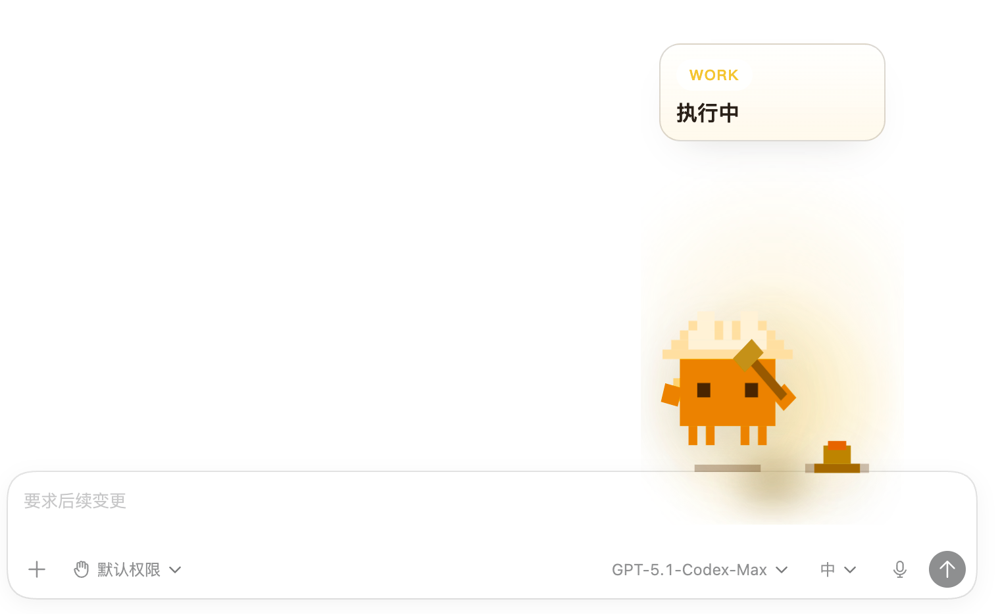

# codepet

一个给自己用的桌面小桌宠：在本机常驻，实时感知你的 AI 编码会话状态（Codex / Cursor），把“思考、执行、改文件、完成、报错”等过程可视化成桌宠动画和状态气泡。

作者：`zyttt`

## 这个项目是做什么的

`codepet` 是一个基于 Electron 的本地桌宠工具，定位是：

- 给独立开发者自己使用
- 在写代码时能一眼看到当前 AI 助手状态
- 把“看不见的执行过程”变成可感知的桌面反馈

核心就是本地运行、本地监听、本地展示。

---

## 核心能力

- 实时状态感知
  - 映射状态：`thinking` / `working` / `editing` / `success` / `error` / `sleeping` 等
- 多来源监听
  - Codex：`~/.codex/sessions/**/*.jsonl`
  - Cursor Agent transcripts：`~/.cursor/projects/.../agent-transcripts/**/*.jsonl`
- 三种连接模式
  - `auto`：自动发现本机会话文件（Codex + Cursor）
  - `managed`：应用自行托管 `codex app-server`
  - `external`：连接外部已有 `codex app-server`
- 桌宠交互
  - 透明窗口、拖拽、双击互动反馈
  - 支持 mini 模式与休眠/唤醒序列
- 状态气泡
  - 显示/隐藏、简略/详细、距离可调
  - 详细模式可显示来源（Codex / Cursor）
- 托盘增强
  - 一键复制当前状态摘要
  - 全局快捷键：`Cmd/Ctrl + Shift + D` 打开状态看板
- 主题与外观
  - 大小：`S/M/L`
  - 主题色预设与自定义十六进制色值

---

## 快速开始

### 1) 安装依赖

```bash
npm install
```

### 2) 启动桌宠

```bash
npm run electron
```

### 3) 启动状态看板（可选）

```bash
npm run dashboard
```

默认地址：

```text
http://127.0.0.1:4580
```

---

## 连接模式说明

### Auto（默认）

- 自动扫描本地 Codex session 文件 + Cursor transcripts
- 默认从文件末尾（EOF）开始增量监听，避免“刚打开就误判执行中”

可选实验参数（重放最近尾部历史）：

```bash
# 两类文件都重放
DESK_AUTO_REPLAY_TAIL_BYTES=262144

# 仅 Codex
CODEX_SESSION_REPLAY_BYTES=262144

# 仅 Cursor transcripts
CURSOR_TRANSCRIPT_REPLAY_BYTES=262144
```

### Managed

应用自行启动并管理 `codex app-server`，适合在桌宠内触发测试 prompt。

### External

连接外部已有 WebSocket 地址：

```bash
CODEX_APP_SERVER_URL=ws://127.0.0.1:8765
CODEX_APP_SERVER_URLS=ws://127.0.0.1:8765,ws://127.0.0.1:8766
```

---

## 托盘可用功能

- 显示/隐藏桌宠
- 显示/隐藏状态气泡
- 气泡信息模式（简略 / 详细）
- 气泡距离（步进、重置、自定义输入）
- 大小（S/M/L）
- 主题颜色（预设 / 自定义）
- 连接模式切换（auto / managed / external）
- 复制当前状态摘要
- 打开状态看板

---

## 当前状态映射（视觉）

| 逻辑状态 | 桌宠表现 | SVG |
| --- | --- | --- |
| `idle` | 待命 | `clawd-idle-follow.svg` |
| `thinking` | 思考中 | `clawd-working-thinking.svg`（高忙碌时 `ultrathink`） |
| `typing` | 输出中 | `clawd-working-typing.svg` |
| `working` | 执行中 | `clawd-working-building.svg` |
| `editing` | 改文件中 | `clawd-working-carrying.svg` |
| `approval` | 提醒 | `clawd-notification.svg` |
| `success` | 完成 | `clawd-happy.svg` |
| `error` | 错误 | `clawd-error.svg` |
| `sleeping` | 休眠 | `clawd-sleeping.svg` |

---

## 项目结构

```text
src/electron/            Electron 主进程、preload、renderer
src/main/codex/          Codex app-server / session 文件监听
src/main/cursor/         Cursor transcript 监听
src/main/state/          状态聚合与优先级
src/shared/              共享类型
src/dashboard/           本地状态看板资源
scripts/                 monitor / dashboard / 辅助脚本
.github/workflows/       CI 构建工作流
```

---

## 截图预览



---

## 本地开发与质量检查

```bash
npm run typecheck
npm run build:electron
```

---

## 打包

```bash
npm run dist:dir
npm run dist:mac
npm run dist:win
```

产物默认在 `release/`。

---

## 已知边界

- `auto` 模式基于本地文件启发式监听，不等价官方事件流
- `external` 模式只监听，不主动创建会话
- `runPrompt` 仅 `managed` 模式可用
- 当前未接入 macOS 公证与 Windows 代码签名

---

## License

本项目采用 [MIT License](LICENSE)。

---

## 致谢与第三方资源说明（保留）

本项目在开发过程中使用并改造了部分第三方资源，感谢原作者贡献：

- 原项目：[`rullerzhou-afk/clawd-on-desk`](https://github.com/rullerzhou-afk/clawd-on-desk)
- 使用内容包括（但不限于）：
  - 部分 SVG 素材
  - 状态机参数与处理思路
  - 眼球跟随相关参数/算法
  - Mini 模式相关设计

原作者信息（按原仓库公开信息保留）：

- GitHub：`rullerzhou-afk`
- 小红书：`鹿鹿🦌`

本项目在上述基础上做了本地化与功能扩展（例如 Cursor transcript 监听、状态摘要复制、快捷键看板等），原始版权归原作者与其项目协议所有。
